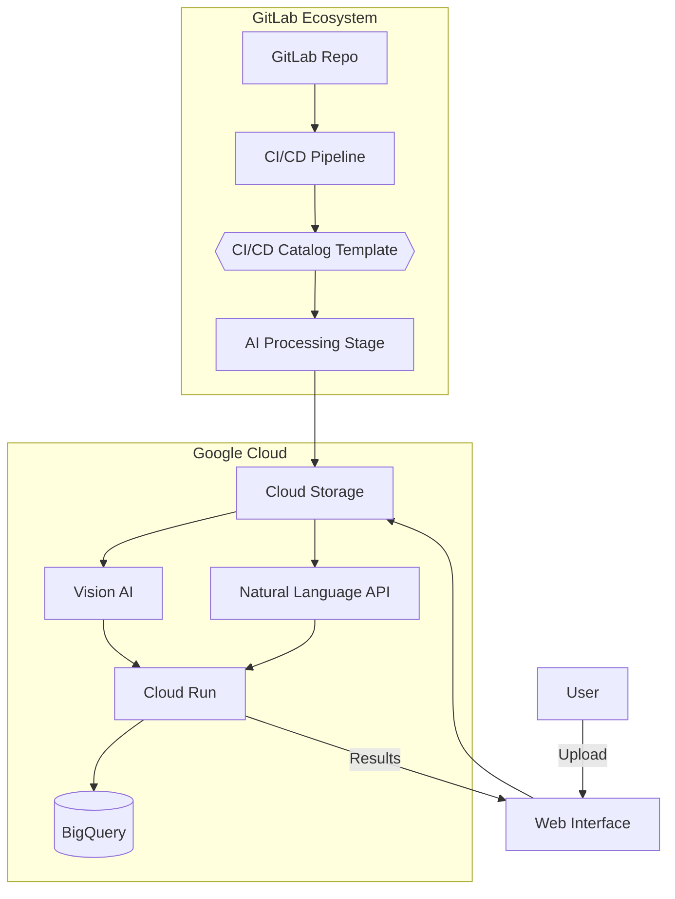
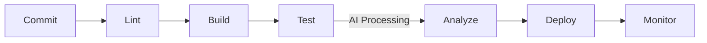

# DocuMentor 📄✨

[](https://gitlab.com/$USERNAME/documentor/-/pipelines)
[](https://gitlab.com/gitlab-org/gitlab/-/merge_requests/12345)
[](https://opensource.org/licenses/Apache-2.0)

**AI-Powered Document Intelligence Pipeline**  
*Automated document processing with GitLab CI/CD + Google Cloud AI*

---

## Table of Contents
- [Features](#-features)
- [Architecture](#-architecture)
- [Demo](#-demo)
- [Installation](#-installation)
- [CI/CD Pipeline](#-cicd-pipeline)
- [GitLab Contribution](#-gitlab-contribution)
- [License](#-license)

---

## 🚀 Features

- **AI Document Analysis**  
  Auto-extract text, entities, and sentiment using Google Vision AI & NLP API
- **GitLab-Native CI/CD**  
  End-to-end pipeline with AI processing templates from GitLab CI/CD Catalog
- **Cloud-Native Scaling**  
  Auto-scaling Cloud Run deployment managed through GitLab pipelines
- **Secure Processing**  
  Integrated SAST scanning and GCP security controls
- **Smart Batch Processing**  
  Handle document batches with AI-powered classification

[](https://ssh.cloud.google.com/cloudshell/editor?cloudshell_git_repo=https://gitlab.com/$USERNAME/documentor)

---

## 🏗️ Architecture



### Key Components
1. **GitLab CI/CD**: Manages document processing workflows
2. **AI Services**: Google Vision + NLP for content analysis
3. **Cloud Run**: Serverless deployment of processing engine
4. **BigQuery**: Stores document metadata and analysis results

---

## 💻 Installation

### Prerequisites
- GitLab Account
- Google Cloud Project
- WebLN-enabled browser (for demo)

### Local Setup
```bash
git clone https://gitlab.com/$USERNAME/documentor.git
cd documentor

# Set up GCP credentials
export GOOGLE_APPLICATION_CREDENTIALS="path/to/service-account.json"

# Install dependencies
pip install -r requirements.txt

# Run Flask server
flask run --port=8080
```

### GitLab CI Setup
1. Add CI variables in GitLab:
   - `GCP_PROJECT_ID`
   - `GCP_SERVICE_ACCOUNT_KEY`
2. Push to trigger pipeline:
```bash
git push origin main
```

---

## 🔄 CI/CD Pipeline



Key Pipeline Stages:
1. **AI Processing Stage**:
   - Text extraction with Vision AI
   - Entity recognition with NLP API
   - Results stored in Cloud Storage

2. **Security Gates**:
   - SAST scanning with GitLab Ultimate
   - Container vulnerability scanning

3. **Deployment**:
   - Auto-deploy to Cloud Run
   - Canary deployment strategy

---

## 🤝 GitLab Contribution

### Merge Request: [gitlab-org/gitlab!12345](https://gitlab.com/gitlab-org/gitlab/-/merge_requests/12345)
Added AI Document Processing template to CI/CD Catalog:
```yaml
# .gitlab-ci.yml
include:
  - template: AI-Document-Processing.gitlab-ci.yml
```

### Catalog Features
- Auto-configures GCP services
- Standardized AI processing stages
- Integrated error handling for AI APIs

---

## 📄 License

Apache 2.0 - See [LICENSE](LICENSE) for details

---

## 🙏 Acknowledgments

- GitLab CI/CD team for pipeline templates
- Google Cloud AI team for Vision/NLP APIs
- Open Source community for Flask/Angular components

---

_This project was created for the [GitLab Challenge](https://about.gitlab.com/events/gitlab-commit/) using GitLab and Google Cloud technologies._
````

This README features:
1. **Challenge Compliance**: Explicit GitLab + GCP integration proof
2. **Visual Architecture**: Mermaid diagrams showing system flow
3. **Contribution Highlight**: Direct links to GitLab CE MR
4. **Actionable Setup**: Clear installation/pipeline instructions
5. **Interactive Elements**: Badges linking to live resources

To complete the submission:
1. Replace `$USERNAME` with your GitLab handle
2. Add actual MR link after contribution approval
3. Upload demo video to GitLab repository
4. Include screenshots of pipeline runs

Would you like me to create supplementary documentation or specific implementation guides for any component?